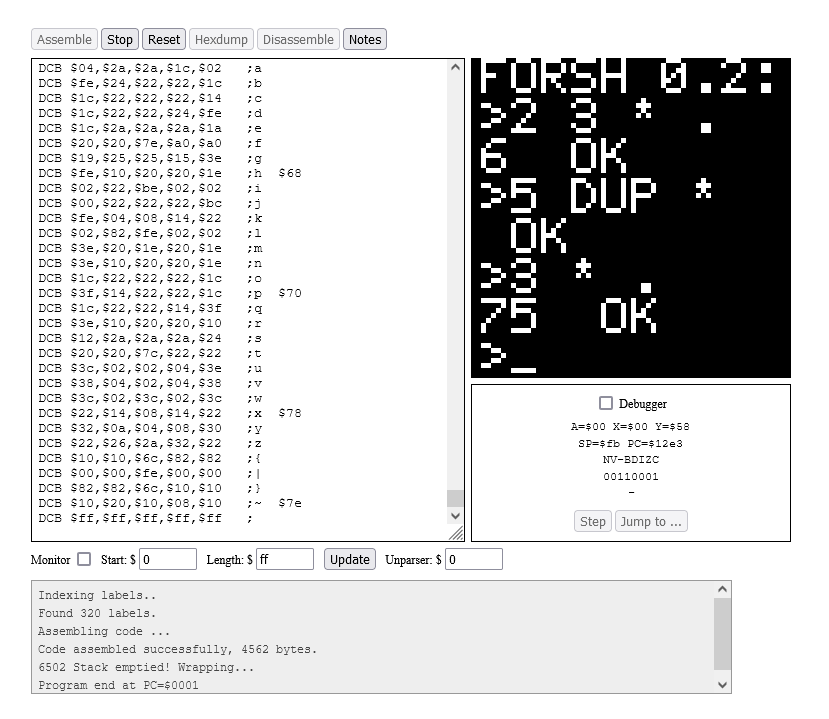

# FORSH Interpreter

(My take on writing a FORTH interpreter): to run it, copy assembly code from mos.txt into the textbox, hit `Assemble`, then `Run`

Because of the way input is handled in 6502js, some of the input controls for the text console are a little janky:
- \d to backspace:
- \c to clear the line
- \e for enter
- \h for help

The shell is a FORTH interpreter written by me.
Try entering the following commands (use `\e` instead of enter)
- `1 2`  push some numbers onto the stack 
- `.S`   show the stack contents
- `3 * + .`  multiply by 3, add, then pop and print the top of stack

## 6502js

I built this on top of the following 6502 simulator I found: https://skilldrick.github.io/easy6502/ (which this repo is a fork of). Most of the code I wrote is in mos.txt and dict.txt, but I did end up extending the simulator/assembler with a few features that made debugging my project easier:
- `define` statements
- arithmetic (ie `label+2`)
- Added label and arithmetic parsing to the debug memory monitor, disassembler, PC display for easy of debugging
- Doubled the size of the simulated screen to be able to write a somewhat usable amount of text

